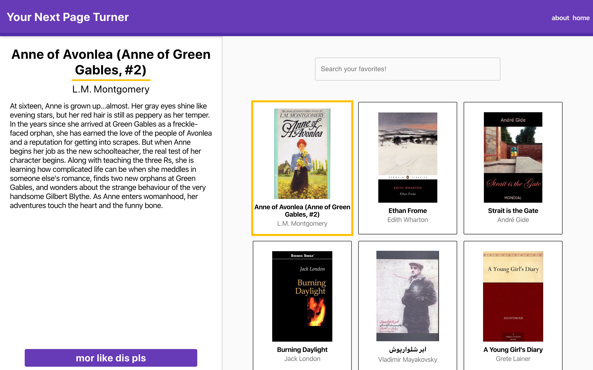

## Backend can be found [here!](https://github.com/rebecca-hh-rosen/your_next_page_turner_backend)

This application has launched with firebase!

At https://your-next-page-turner.web.app/

Demo can be found [here!](https://drive.google.com/open?id=1V4Frow-wnazMeUxAMlwpaVhSh0TljVKi)

# Your Next Page Turner

Your next page turner is an application that allows users to find recommended books based on the content of the book itself!

### Technologies

* React w/ Hooks
* Typescript
* Material-UI

This project was bootstrapped with [Create React App](https://github.com/facebook/create-react-app).

### Things to do:

* Auto scroll up to top when a book is recommended.
* Find visual bugs.
* Research better UX experience. 